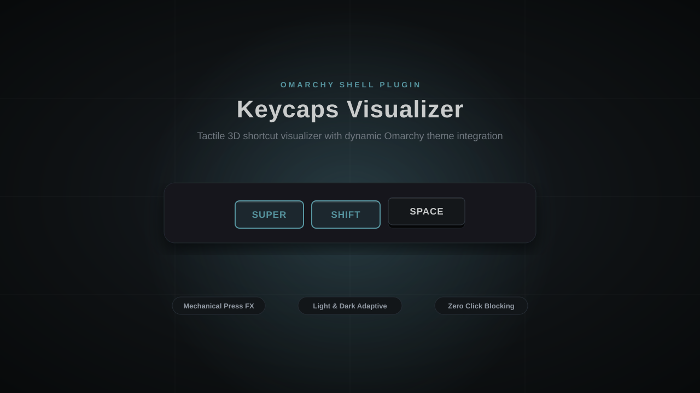

# Omarchy Keycaps Plugin

Visual keyboard shortcut overlay for the Omarchy shell. Displays currently-held keyboard shortcuts as tactile 3D mechanical keycaps centered at the bottom of the screen.

Press `Super + Space`, `Ctrl + Shift + Esc`, or any shortcut combination and watch the keycaps dynamically depress with active theme lighting, then smoothly spring back and fade away upon release.



## Features

- **Mechanical Keycap Styling**: Realistic 3D keycap geometry with bottom shadow bevels, depression travel animations on press, and spring return on release.
- **Theme-Adaptive**: Fully integrated with Omarchy's color tokens (`Color.popups.*`, `Color.accent`) and typography (`Style.font.*`). Looks sharp and maintains high contrast in both light and dark themes.
- **Smart Filtering**: Ignores normal typing (letters, numbers, space, standalone Shift); only activates when shortcut modifiers (`Super`, `Ctrl`, `Alt`) are invoked.
- **Safe Layer-Shell Window**: Rendered via Wayland layer-shell on the currently focused monitor with an empty input mask, ensuring it never blocks desktop clicks or gaming inputs.

---

## Installation

### 1. Install via Omarchy Shell

```bash
omarchy plugin add https://github.com/atascg01/omarchy-keycaps --enable
```

### 2. Wire the Hyprland Event Bridge

Key events are captured through Hyprland's lightweight event stream and forwarded via IPC. Run the bundled installer to hook the bridge:

```bash
bash ~/.config/omarchy/plugins/omarchy-keycaps/install.sh
hyprctl reload
```

---

## How It Works

1. **Hyprland Event Hook** (`hypr/keys.lua`): Tracks left/right physical modifiers separately, includes Shift held before a shortcut, and ignores key repeats. Publishes complete shortcut snapshots through `hl.dispatch(hl.dsp.event(...))` on Hyprland's ordered socket2 stream, without spawning processes. Each snapshot includes a bridge session ID and increasing sequence number. A one-second heartbeat reconciles physical key state and recovers shell restarts or missed releases; ordinary typing is never forwarded. Releasing the last shortcut modifier flushes regular keys, and compositor reload clears the display.
2. **Quickshell Service** (`Service.qml`, `ShortcutState.js`): Receives snapshots through `Hyprland.rawEvent`, rejects stale sequences, and displays one cap per logical modifier. Released caps spring back immediately and remain visible for the dismissal delay. Empty heartbeats do not extend that delay; a new shortcut cancels it. The original diagnostic IPC commands remain available.
3. **Quickshell Overlay Panel** (`Panel.qml`): Multi-monitor aware Quickshell layer surface rendered on `Hyprland.focusedMonitor` with smooth entry/exit opacity and slide transitions.

---

## Settings

Edit the **existing** `omarchy-keycaps` entry in the `plugins` array of
`~/.config/omarchy/shell.json`. Preserve the other entries and top-level fields:

```json
{
  "id": "omarchy-keycaps",
  "hideAfter": 1200,
  "keycapScale": 1,
  "bottomOffset": 64
}
```

| Setting | Default | Range | Meaning |
| --- | --- | --- | --- |
| `hideAfter` | `1200` | `0–10000` | Milliseconds after the final shortcut modifier is released; `0` begins fading immediately. |
| `keycapScale` | `1` | `0.5–2` | Scales cap dimensions, labels, gaps, and corner radii together, on top of the shell's UI scale. |
| `bottomOffset` | `64` | `0–1000` | Distance from the screen bottom in shell-scaled units, independent of keycap size. |

Changes apply live when the file is saved. Missing or nonnumeric fields use
defaults; numeric values outside the range are clamped. A temporarily invalid
JSON document retains the last valid settings. Inspect effective values with:

```bash
omarchy-shell omarchy-keycaps getSettings
```

After upgrading plugin **code**, run `omarchy-restart-shell` and `hyprctl reload`.
Omarchy retains `keepLoaded` service instances until the shell restarts.
The bridge requires Hyprland's Lua API, including `hl.dsp.event`; labels remain
a fixed XKB mapping with support for the global `altwin:swap_lalt_lwin` option
and literal `kb_options` assignments in `~/.config/hypr/input.lua` (including
Keychron device overrides). Commented examples are ignored. This mapping is
shared across keyboards because the Lua key event does not identify the source
device; simultaneous keyboards with different mappings are not distinguished.

---

## Manual Verification

Verify that the service is running and responsive:

```bash
# Ping the service
omarchy-shell omarchy-keycaps ping

# Simulate manual key events:
omarchy-shell omarchy-keycaps keyEvent SUPER 1   # Super down
omarchy-shell omarchy-keycaps keyEvent 65 1      # Space down
omarchy-shell omarchy-keycaps keyEvent 65 0      # Space up
omarchy-shell omarchy-keycaps keyEvent SUPER 0   # Super up

# A full diagnostic state; an empty array releases every displayed cap:
omarchy-shell omarchy-keycaps snapshot '["CTRL","SHIFT",9]'
omarchy-shell omarchy-keycaps snapshot '[]'
omarchy-shell omarchy-keycaps clear
```

The live bridge's next snapshot supersedes diagnostic state. For physical-key
verification, try Shift → Super → Space, hold both Ctrl keys and release just
one, switch Super+1 → Super+2, and release Super before Space. Check that held
keys stay depressed, released keys spring back, and the panel dismisses once.
Reload Hyprland during a shortcut, then try another shortcut. Also check light
and dark themes, monitor focus changes, and click-through behavior.

## Development tests

From the repository root, with Node.js 22+, Lua 5.4+, and Python 3.12+:

```bash
node --test tests/*.test.js
lua tests/bridge.test.lua
bash tests/installer.test.sh
python -m pip install PySide6-Essentials==6.11.2
python tests/qml-smoke.py
```

The tests cover modifier order and both sides, repeats, shortcut transitions,
release snapshots, stale packets, reloads, recovery heartbeats, settings, and
installer preservation. The QML smoke test runs the production service and
panel layout with real Qt timers and stubbed host APIs. It does **not** replace
the native Hyprland/Wayland checks above. GitHub Actions runs all four suites.
Test runtimes are development dependencies only.

---

## Uninstallation

To cleanly remove the plugin:

```bash
# 1. Unhook the Lua bridge from ~/.config/hypr/hyprland.lua:
bash ~/.config/omarchy/plugins/omarchy-keycaps/install.sh --uninstall
hyprctl reload

# 2. Remove the plugin from Omarchy shell:
omarchy plugin remove omarchy-keycaps --yes
```

The installer owns only its `BEGIN/END omarchy-keycaps bridge` block. It also
recognizes the exact loader lines generated by earlier versions (including
`andrestascon.keys`), leaving unrelated mentions untouched. Changes create
uniquely named `.bak.*` backups beside the config; repeated runs are idempotent.
Unpaired markers cause an error without changing the file. For a nonstandard
config path, set `KEYCAPS_HYPRLAND_CONFIG` when running the installer.

---

## License

[MIT](LICENSE) © Andres Tascon
